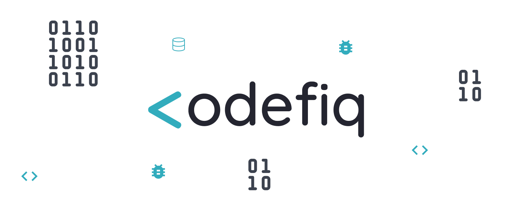

<h1 align="center">
  
</h1>

<p align="center">📱 Um app que te ensina a programar em pt/🇧🇷</p>

<h4 align="center"> 
	🚧  Em construção...  🚧
</h4>

---

## 💡 Objetivo

Considerando que grande parte dos aplicativos que ensinam a programar estão disponibilizados em língua estrangeira, o que impossibilita vários brasileiros que não possuem fluência nessas de continuar seus estudos nesses aplicativos,
foi projetado o <strong>Codefiq</strong>, com o foco de ajudar aqueles que querem aprender sobre programação desde o zero, porém não sabem por onde começar.

## 🎨 Layout

Em breve...

---

## 💻 Executando o Codefiq

### Pré-requisitos

É necessário ter instalado na sua máquina para execução desse projeto:
- NodeJS
- Gerenciador de pacotes (Npm ou Yarn)

Além disso, pode ser necessário seguir o passo a passo do setup disponível no site do React Native,
 caso queira executar na sua máquina, é preciso ter um emulador configurado
 e caso queira executar em um dispositivo android real certifique-se de tê-lo conectado por um cabo usb com modo de depuração do android ativo. 

> Em breve mais detalhes...

### 🌐 Rodando o Servidor

```bash

	🚧  Em construção...  🚧

```
### 📱 Rodando o app Codefiq

<br>

Entre na pasta do mobile

```bash

$ cd mobile

```

<br>

Instale as dependências

```bash

$ yarn

```

> ou

```bash

$ npm install

```

<br>

Inicie o metro bundler

```bash

$ yarn start

```

> ou

```bash

$ npm start

```

<br>

Instale o app

```bash

$ yarn android

```

> ou 

```bash

$ npm android

```

<br>

Se tudo deu certo, o app deve estar disponível agora! 👩‍🔧

---

## 🛠️ Tecnologias

### Backend:
- <a href="https://nodejs.org/en/">NodeJS<a/>
- ...
- ...

### Mobile:
- <a href="https://reactnative.dev/">React Native<a/> ⚛️

---

## Desenvolvedores 👨‍💻

### Arlene Pelenda 
⚙️ Contribuições:
 - Idealizadora
 - Autora da documentação
 - ...

### Lohana Torres
⚙️ Contribuições:
 - Idealizadora
 - Design de UI/UX
 - Desenvolvimento do frontend mobile

### Gean de Magalhães
⚙️ Contribuições:
 - Idealizador
 - Produtor de conteúdo
 - ...

---

## Autora

 
 <p align="center">Feito com ❤️ por Lohana Torres<p/>
