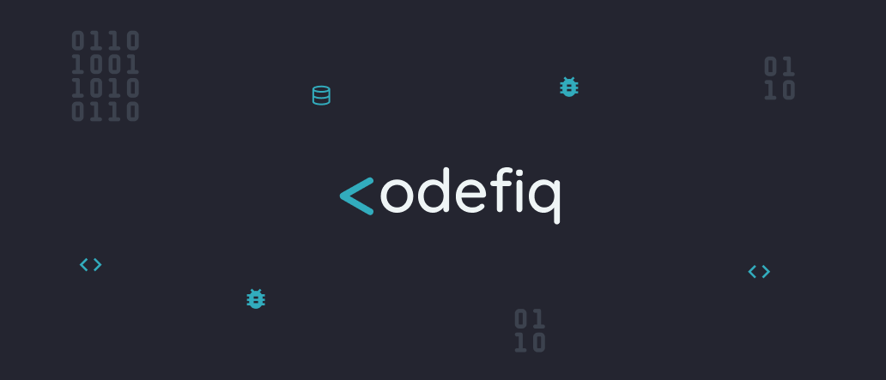
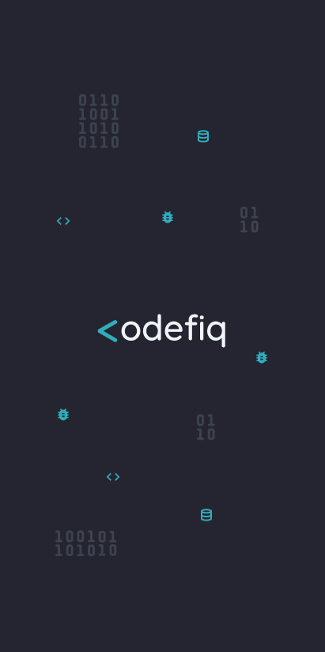
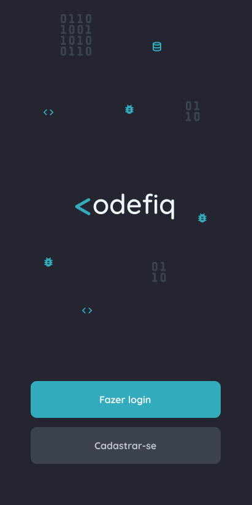
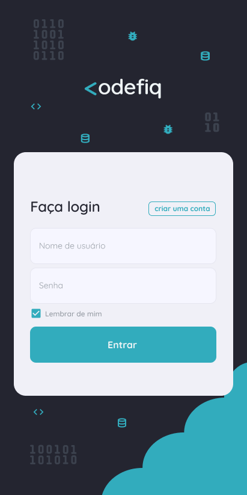
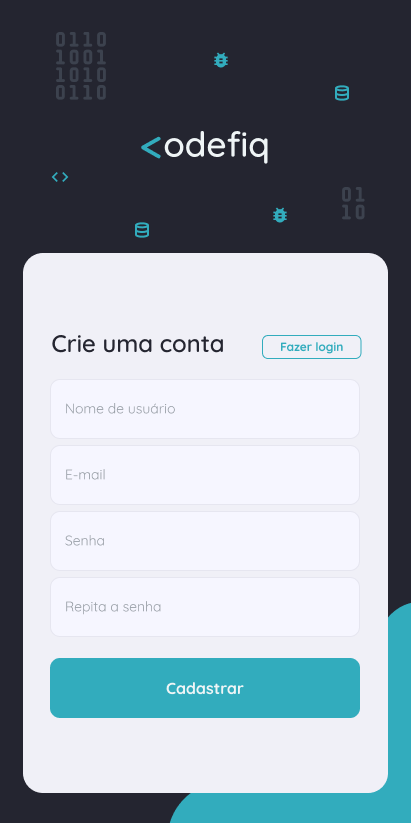

<h1 align="center">
  
</h1>

<p align="center">📱 Um app que te ensina a programar em pt/🇧🇷</p>

<h4 align="center"> 
	🚧  Em construção...  🚧
</h4>

---

## 💡 Objetivo

Este é um projeto idealizado para conclusão do curso técnico em Informática no CEFET/RJ, mas que pretende ir além do diploma. 

Considerando que grande parte dos aplicativos que ensinam a programar estão disponibilizados em língua estrangeira, o que impossibilita vários brasileiros que não possuem fluência nessas de continuar seus estudos nesses aplicativos,
foi projetado o <strong>Codefiq</strong>.

### De 🇧🇷 para 🇧🇷

Com o foco de ajudar aqueles que querem aprender sobre programação desde o zero, porém não sabem por onde começar e gostam da possibilidade de aprender de qualquer lugar com o auxílio do seu 📱. 

Este app, com conteúdo em nossa língua nativa, te possibilita aprender desde Lógica de Programação até tópicos mais avançados
 da forma mais simplificada que nosso time puder ensinar. 😉

---

## 🎨 Layout

<p align="center">
  

  

  
  
  
</p>

---

## 💻 Executando o Codefiq

### Pré-requisitos

É necessário ter instalado na sua máquina para execução desse projeto:
- NodeJS
- Gerenciador de pacotes (Npm ou Yarn)

Além disso, pode ser necessário seguir o passo a passo do setup disponível no site do React Native,
 caso queira executar na sua máquina, é preciso ter um emulador configurado
 e caso queira executar em um dispositivo android real certifique-se de tê-lo conectado por um cabo usb com modo de depuração do android ativo. 

> Em breve mais detalhes...

### 🌐 Rodando o Servidor

```bash

	🚧  Em construção...  🚧

```
### 📱 Rodando o app Codefiq

<br>

Entre na pasta do mobile

```bash

$ cd mobile

```

<br>

Instale as dependências

```bash

$ yarn

```

> ou

```bash

$ npm install

```

<br>

Inicie o metro bundler

```bash

$ yarn start

```

> ou

```bash

$ npm start

```

<br>

Instale o app

```bash

$ yarn android

```

> ou 

```bash

$ npm android

```

<br>

Se tudo deu certo, o app deve estar disponível agora! 👩‍🔧

---

## 🛠️ Tecnologias

### Backend:
- <a href="https://nodejs.org/en/">NodeJS</a>
- ...
- ...

### Mobile:
- <a href="https://reactnative.dev/">React Native</a> ⚛️
- <a href="https://reactnavigation.org/">React Navigation</a> ⚛️
> Mais informações no arquivo package.json da pasta /mobile

---

## 👨‍💻 Desenvolvedores

### Arlene Pelenda 
⚙️ Contribuições:
 - Idealização
 - Produção de documentação
 - ...

### Lohana Torres
⚙️ Contribuições:
 - Idealização
 - Design de UI/UX
 - Desenvolvimento da aplicação mobile

### Gean de Magalhães
⚙️ Contribuições:
 - Idealização
 - Produção de conteúdo didático
 - ...

---

## Autora

 <p>Feito com 💙 por Lohana Torres</p>
