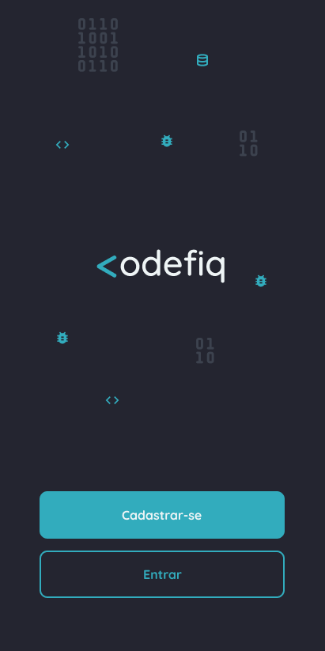
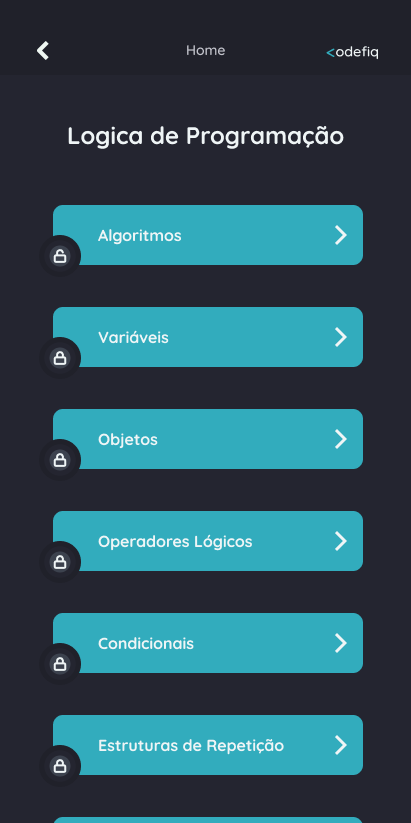
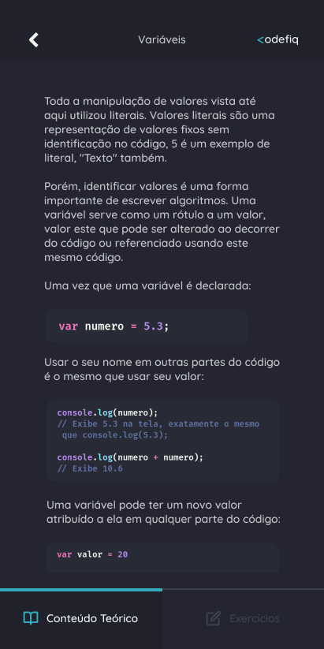
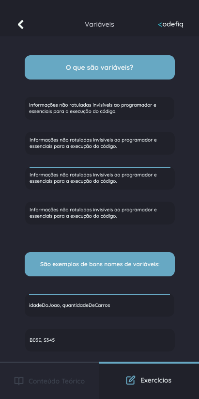

<h1 align="center">
  
</h1>

📱 Um app que te ensina a programar em pt-🇧🇷

<!-- <h4 align="center">
	🚧  Em construção...  🚧
</h4> -->

 <a href="#-objetivo">Objetivo</a> •
 <a href="#-layout">Layout</a> • 
 <a href="#-executando-o-codefiq">Como executar</a> • 
 <a href="#-tecnologias">Tecnologias</a> •  
 <a href="#-desenvolvedores">Desenvolvedores</a> • 
 <a href="#-licença">Licença</a>

---

## 💡 Objetivo

Este é um projeto idealizado para conclusão do curso técnico em Informática no CEFET/RJ.

Considerando que grande parte dos aplicativos que ensinam a programar estão disponibilizados em língua estrangeira, o que impossibilita vários brasileiros que não possuem fluência nessas línguas de continuar seus estudos nesses aplicativos, foi projetado o <strong>Codefiq</strong>.

### De 🇧🇷 para 🇧🇷

Com o foco de ajudar aqueles que querem aprender sobre programação desde o zero, porém não sabem por onde começar e gostam da possibilidade de aprender de qualquer lugar com o auxílio do seu smartphone no seu idioma nativo.

---

## 🎨 Layout

Veja o protótipo no [Figma](https://www.figma.com/proto/GLdUH9W0zdrJ7RMUumZxNS/Codefiq?node-id=122%3A784&scaling=scale-down).

  

  

  
  
  
  
  
  
  
  
  

---

## 💻 Executando o Codefiq

Baixe e instale o último release do app no link: https://github.com/heyloh/codefiq/releases

 

Se tudo deu certo, o app deve estar disponível agora! 👩‍🔧

---

## 🛠 Tecnologias

As seguintes ferramentas foram usadas na construção do projeto:

- <a href="https://reactjs.org/">ReactJS</a>
- <a href="https://reactjs.org/docs/context.html">Context API</a>
- <a href="https://reactnative.dev/">React Native</a> ⚛️
- <a href="https://reactnavigation.org/">React Navigation</a> ⚛️
- <a href="https://github.com/crazycodeboy/react-native-splash-screen">React Native Splash Screen</a>

> Mais informações no arquivo `package.json`

---

## 📝 Licença

Este projeto está sobe a licença [Apache 2.0](./LICENSE).

---

Feito com 💙 por Lohana Torres 👋🏽

